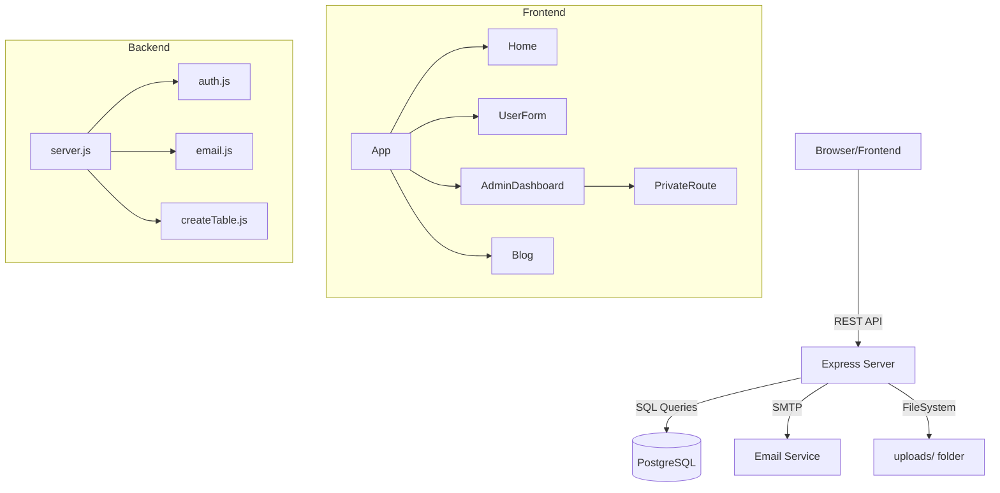

# Phase 1: Project Discovery & Mapping

## 🏗️ System Architecture

The project consists of a React frontend and a Node.js/Express backend. It uses PostgreSQL as the primary database.

### Frontend
- **Framework**: React (Create React App)
- **Styling**: Tailwind CSS, Vanilla CSS
- **Routing**: React Router DOM (v6)
- **State Management**: React Context API (`AuthContext`)
- **Key Components**:
  - `Home.js`: Landing page
  - `UserForm.js`: Enquiry form
  - `AdminDashboard.js`: Admin management
  - `BlogPage.js` & `AdminBlogDashboard.js`: Content management

### Backend
- **Framework**: Express.js
- **Database**: PostgreSQL (via `pg` pool)
- **Authentication**: JWT & Bcryptjs
- **File Storage**: Local `uploads/` directory via Multer
- **Email**: Nodemailer (Gmail)
- **Structure**: Monolithic `server.js` containing all routes and logic.

---

## 🔗 Dependency Graph

---

## 🚨 Critical Failure Points & Issues

1.  **Hardcoded Credentials**: Database password and connection details are hardcoded in both `server.js` and `createTable.js`.
2.  **Monolithic Backend**: `server.js` is bloated (550+ lines) with mixed concerns (routing, business logic, DB queries).
3.  **Duplicate Pool Creation**: Multiple files (`server.js`, `createTable.js`) create their own `pg` pools, which can lead to connection leaks or conflicts.
4.  **Inconsistent Auth**: `auth.js` checks for a token but doesn't handle the "Bearer " prefix, which the frontend might be sending (or vice versa).
5.  **Lack of Validation**: Backend routes do not validate incoming data types or mandatory fields before hitting the database.
6.  **Error Handling**: No centralized error handler middleware; many routes have basic try-catch blocks that just send "Internal server error".
7.  **Unorganized Frontend**: Components like `UserForm2.js` exist but aren't clearly used; large components (80KB+) suggest a need for decomposition.
8.  **Typos in Directory Names**: `backened` and `frontened` are misspelled, which is unprofessional though functional.

---

## 🛠️ Proposed Phase 2 Plan (Backend)
1.  **Initialize Structure**: Create `src/` with subfolders.
2.  **Centralize Config**: Move DB and Environment config to a single source of truth.
3.  **Modularize Routes**: Break `server.js` into feature-based routes.
4.  **Service Layer**: Extract DB logic into service functions.
5.  **Middleware**: Add error handling and input validation.
